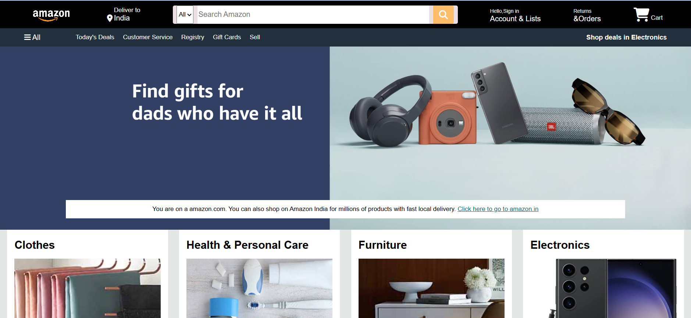

# 🛒 Amazon Clone

A responsive front-end Amazon homepage clone built using **HTML5 and CSS3**.  
This project replicates the layout and basic design of Amazon’s landing page for learning and practice purposes.

---

## 🚀 Live Preview
🔗 **Live Demo:**  
https://amazon-clone-anupriya.netlify.app

---

## 💻 Run Locally

Open the project by running:

index.html

Or using Live Server:

http://localhost:3000/

> ⚠️ This project runs locally. Deploy it using GitHub Pages or Netlify for a public live link.

---

## 📌 Features

- 🧭 Navigation bar with search functionality (UI)
- 👤 Sign In & Account section
- 📦 Returns & Orders section
- 🛍 Shopping Cart icon
- 🖼 Hero banner section
- 🛒 Product category boxes
- 🎨 Clean and structured UI design
- 📱 Basic responsive layout

---

## 🛠 Tech Stack

- HTML5
- CSS3
- Font Awesome (Icons)

---

## 📂 Project Structure

Amazon-Clone/
│
├── index.html
├── style.css
├── amazon_logo.png
├── hero_image.jpg
├── box1_image.jpg
├── box2_image.jpg
├── box3_image.jpg
├── box4_image.jpg
├── box5_image.jpg
├── box6_image.jpg
├── box7_image.jpg
├── box8_image.jpg
├── screenshot.png
└── README.md

---

## 📸 Screenshot

---

## 🎯 Learning Outcomes

- Structured webpage layout using semantic HTML
- Styling using CSS Flexbox
- Creating navigation bars and UI sections
- Organizing project assets properly
- Building real-world UI clones

---

## 🔥 Future Improvements

- Add JavaScript functionality
- Add product pages
- Implement cart functionality
- Make fully responsive
- Connect with backend (MERN Stack)
- Deploy online (GitHub Pages / Netlify)

---

## 👩‍💻 Author

**Anupriya Singh**

GitHub: https://github.com/Anupriya-Singh06

---

⭐ If you like this project, feel free to star the repository!